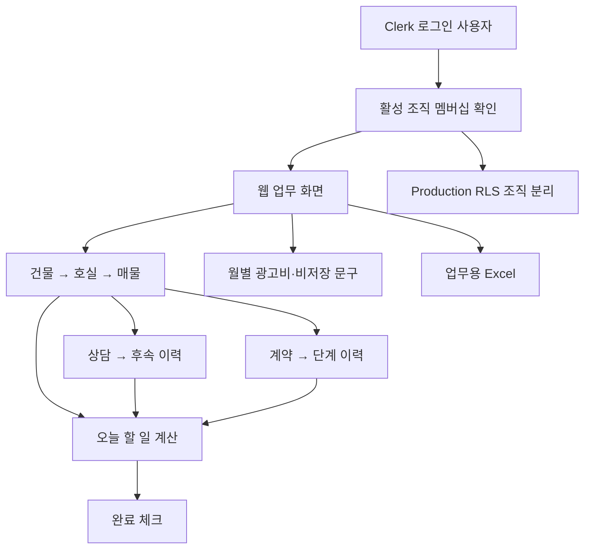

# 재빌드 구조 다이어그램

```mermaid
flowchart TD
  U[Clerk 로그인 사용자] --> M[활성 조직 멤버십 확인]
  M --> A[웹 업무 화면]
  A --> L[건물 → 호실 → 매물]
  L --> C[상담 → 후속 이력]
  L --> K[계약 → 단계 이력]
  L --> T[오늘 할 일 계산]
  C --> T
  K --> T
  T --> D[완료 체크]
  A --> AD[월별 광고비·비저장 문구]
  A --> E[업무용 Excel]
  M --> R[Production RLS 조직 분리]
```

일반 매물 수정은 현재 매물을 변경하며, 연결 상담·계약은 유지한다. 계약 상태의 연결 반영은 사용자 확인 뒤에만 실행한다.
