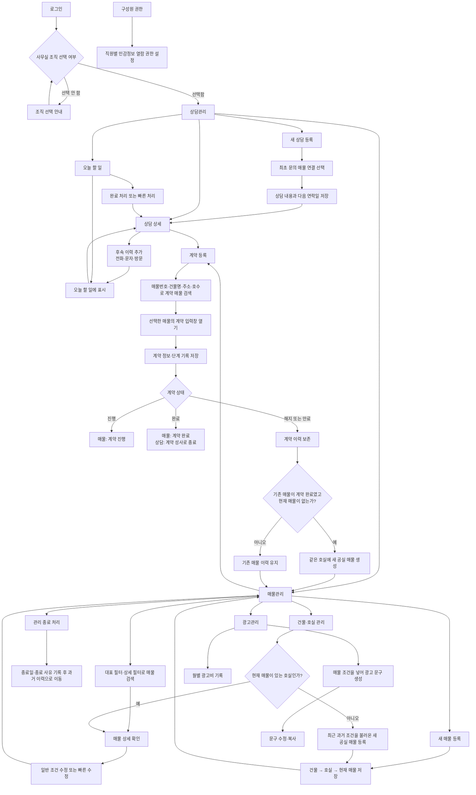
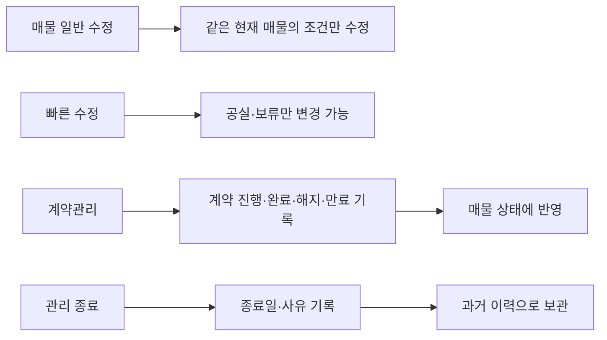

# 웹프로젝트 업무 흐름 다이어그램

> 기준일: 2026-08-31
> 이 다이어그램은 현재 웹서비스에서 직원이 매물·상담·계약 업무를 처리하는 큰 흐름을 보여 줍니다.

## 상태 변경 원칙

## 참고

- 계약 완료 뒤 해지·만료 처리와 새 공실 자동 생성은 migration 파일에 작성되어 있으며, Dev DB 적용 상태는 `PROJECT_STRUCTURE_INDEX.md`와 `CURRENT_IMPLEMENTATION_STATUS.md`에서 확인합니다.
- 사진 유무와 재확인일은 현재 웹 업무와 DB에서 제거하는 방향으로 정리되어 있습니다.
